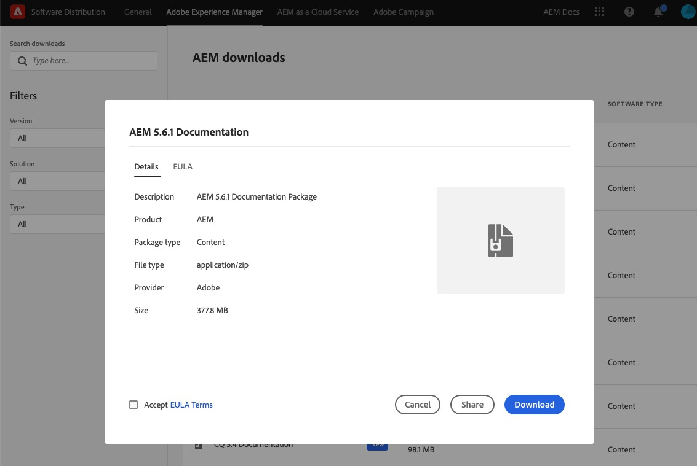

# Äldre versioner av [!DNL Adobe Experience Manager]-, CQ- och CRX-dokumentation {#older-versions-aem-cq-crx}

Hitta tidigare hjälpguider för äldre versioner av AEM, CQ och CRX.

## Äldre versioner av [!DNL Experience Manager]-dokumentation {#older-version-aem-documentation}

Versionerna av [!DNL Adobe Experience Manager], CQ och CRX på den här sidan är End of Life och säljs inte längre officiellt av Adobe. Adobe senaste versioner av officiell dokumentation för dessa äldre versioner finns att tillgå för självhjälp. Adobe rekommenderar att du uppgraderar till den senaste versionen - [[!DNL Adobe Experience Manager] as a Cloud Service](https://experienceleague.adobe.com/en/docs/experience-manager-cloud-service).

>[!NOTE]
>
>Om du vill veta när en [!DNL Experience Manager]-version har nått slutet av kärnsupporten läser du [produkter och perioder för teknisk support](https://helpx.adobe.com/support/programs/eol-matrix.html) och söker efter `AEM`.

### Innan du installerar {#before-installation}

Innan du laddar ned paketet bör du avgöra vem som förbrukar innehållet. Det här beslutet avgör hur det distribueras:

* Utvecklare kan installera lokalt för snabb referens.
* För större behov av organisationsdokumentation rekommenderar Adobe att paketet distribueras på en internt tillgänglig, icke-produktionsbaserad AEM Author-instans.

>[!NOTE]
>
>Användare måste vara inloggade i instansen [!DNL Experience Manager] för att komma åt det här innehållet på författaren till [!DNL Experience Manager]. Det här innehållet är inte tillgängligt som standard på AEM Publish (som det finns under /libs).

## Platser för programdistribution {#software-distribution-locations}

Ett giltigt Adobe ID krävs:

* Om du inte har någon Adobe ID kan du skapa en på https://www.adobe.com/
Om du behöver hjälp med att skapa eller hantera din Adobe ID kan du [läsa den här handboken](https://helpx.adobe.com/manage-account.html)

| [!DNL Experience Manager] version | Software Distribution Link |
|:-----------:|:--------------------------------------------------:|
| [!DNL Experience Manager] 6.4 | [Adobe Experience Manager 6.4-dokumentation](https://experienceleague.adobe.com/en/docs/experience-manager-64) |
| [!DNL Experience Manager] 6.3 | [Hämta AEM-DOCS-6.3 från programvarudistribution](https://experience.adobe.com/#/downloads/content/software-distribution/en/aem.html?package=/content/software-distribution/en/details.html/content/dam/aem/public/adobe/packages/aem-docs/aem-docs-6-3.zip) |
| [!DNL Experience Manager] 6.2 | [Hämta AEM-DOCS-6.2 från programvarudistribution](https://experience.adobe.com/#/downloads/content/software-distribution/en/aem.html?package=/content/software-distribution/en/details.html/content/dam/aem/public/adobe/packages/aem-docs/aem-docs-6-2.zip) |
| [!DNL Experience Manager] 6.1 | [Hämta AEM-DOCS-6.1 från programvarudistribution](https://experience.adobe.com/#/downloads/content/software-distribution/en/aem.html?package=/content/software-distribution/en/details.html/content/dam/aem/public/adobe/packages/aem-docs/aem-docs-6-1.zip) |
| [!DNL Experience Manager] 6.0 | [Hämta AEM-DOCS-6.0 från programvarudistribution](https://experience.adobe.com/#/downloads/content/software-distribution/en/aem.html?package=/content/software-distribution/en/details.html/content/dam/aem/public/adobe/packages/aem-docs/aem-docs-6-0.zip) |
| [!DNL Experience Manager] 5.6.1 | [Hämta AEM-DOCS-5.6.1 från programvarudistribution](https://experience.adobe.com/#/downloads/content/software-distribution/en/aem.html?package=/content/software-distribution/en/details.html/content/dam/aem/public/adobe/packages/aem-docs/aem-docs-5-6-1.zip) |
| [!DNL Experience Manager] 5.6 | [Hämta AEM-DOCS-5.6 från programvarudistribution](https://experience.adobe.com/#/downloads/content/software-distribution/en/aem.html?package=/content/software-distribution/en/details.html/content/dam/aem/public/adobe/packages/aem-docs/aem-docs-5-6.zip) |
| CQ 5.5 | [Hämta CQ-DOCS-5.5 från programvarudistribution](https://experience.adobe.com/#/downloads/content/software-distribution/en/aem.html?package=%2Fcontent%2Fsoftware-distribution%2Fen%2Fdetails.html%2Fcontent%2Fdam%2Faem%2Fpublic%2Fadobe%2Fpackages%2Faem-docs%2Faem-docs-5-5.zip) |
| CQ 5.4 | [Hämta CQ-DOCS-5.4 från programvarudistribution](https://experience.adobe.com/#/downloads/content/software-distribution/en/aem.html?package=/content/software-distribution/en/details.html/content/dam/aem/public/adobe/packages/aem-docs/aem-docs-5-4.zip) |
| CQ 5.3 | [Hämta CQ-DOCS-5.3 från programvarudistribution](https://experience.adobe.com/#/downloads/content/software-distribution/en/aem.html?package=/content/software-distribution/en/details.html/content/dam/aem/public/adobe/packages/aem-docs/aem-docs-5-3.zip) |
| CRX 2.3 | [Hämta CRX-DOCS-2.3 från programvarudistribution](https://experience.adobe.com/#/downloads/content/software-distribution/en/aem.html?package=/content/software-distribution/en/details.html/content/dam/aem/public/adobe/packages/aem-docs/crx-docs-2-3.zip) |
| CRX 2.2 | [Hämta CRX-DOCS-2.2 från programvarudistribution](https://experience.adobe.com/#/downloads/content/software-distribution/en/aem.html?package=/content/software-distribution/en/details.html/content/dam/aem/public/adobe/packages/aem-docs/crx-docs-2-2.zip) |
| CRX 2.1 | [Hämta CRX-DOCS-2.1 från programvarudistribution](https://experience.adobe.com/#/downloads/content/software-distribution/en/aem.html?package=/content/software-distribution/en/details.html/content/dam/aem/public/adobe/packages/aem-docs/crx-docs-2-1.zip) |
| CRX 2.0 | [Hämta CRX-DOCS-2.0 från programvarudistribution](https://experience.adobe.com/#/downloads/content/software-distribution/en/aem.html?package=/content/software-distribution/en/details.html/content/dam/aem/public/adobe/packages/aem-docs/crx-docs-2-0.zip) |

## Installera ett dokumentationspaket {#how-to-install-documentation-package}

Om du vill installera ett äldre dokumentationspaket måste du ha [!DNL Experience Manager] installerat och igång på den lokala enheten eller nätverksenheten.

### Hämta dokumentationspaketet {#download-documentation-package}

1. I tabellen ovan väljer du länken för den [!DNL Experience Manager]-dokumentationsversion som ska hämtas. AEM 5.6.1.

1. Logga in med din Adobe ID. Om du inte har något ID skapar du ett.

1. Välj knappen **[!UICONTROL Download]**.

1. Här är ett exempel på vad du ser:

### Installera paketet på den lokala instansen {#install-package-local-instance}

>[!NOTE]
>
>För AEM 6.2 kan du starta den lokala instansen med en ökad maxheap-storlek med det här kommandot, till exempel: ` java -jar -XX:MaxPermSize=2048m aem-author.jar`

1. Öppna användargränssnittet för [!DNL Experience Manager]. Ange `http://localhost:4502/` i en webbläsare. Logga in som administratör.

1. Välj **[!UICONTROL Tools]** > **[!UICONTROL Deployment]** > **[!UICONTROL Packages]**.

1. Välj **[!UICONTROL Upload Package]** i pakethanterarens användargränssnitt.

1. Bläddra till den plats där du hämtade AEM.

1. Markera paketet och klicka på **[!UICONTROL OK]**.

1. När paketet har överförts installerar du det.

1. Leta reda på paketet och välj **[!UICONTROL Install]** i pakethanterarens användargränssnitt.

1. Välj **[!UICONTROL Install]** igen i bekräftelsedialogrutan. Installationen tar några minuter.

1. Starta dokumentationssidan i en webbläsare. Med hjälp av AEM 5.6.1 blir URL:en: http://localhost:4502/libs/aem-docs/content/en/cq/5-6-1.html.

## Få hjälp från communityn [!DNL Experience Manager] {#get-help-from-aem-community}

Om du har frågor om hur du använder Experience Manager rekommenderar Adobe att du [kontaktar erfarna community-experter i [!DNL Experience Manager] forumen](https://experienceleaguecommunities.adobe.com/t5/adobe-experience-manager/ct-p/adobe-experience-manager-community).
